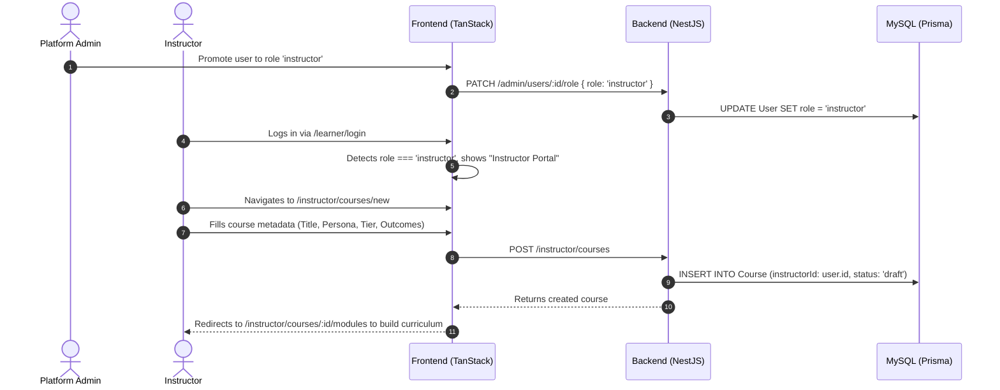
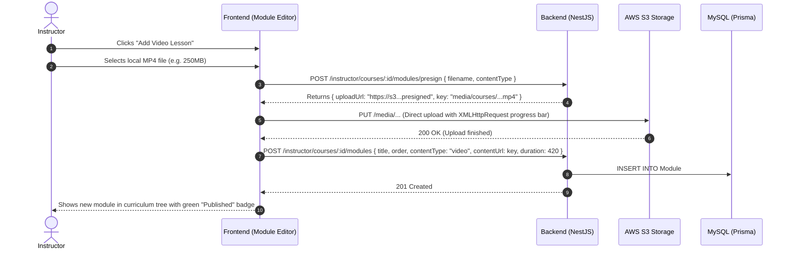
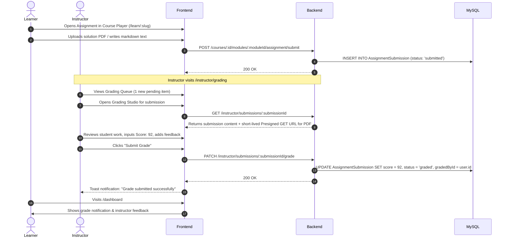

# Instructor Dashboard Feature & Implementation Specification

> **Platform:** AI Encyclopedia (AI Encyclovia)  
> **Backend Architecture:** NestJS, Prisma ORM, MySQL, AWS S3 / CloudFront, BullMQ  
> **Frontend Architecture:** TanStack Start / Router (React 19), Tailwind CSS v4, Radix UI, Lucide Icons, Recharts, TanStack Query  
> **Document Status:** Complete Implementation Blueprint  
> **Target File Location:** `INSTRUCTOR_DASHBOARD_IMPLEMENTATION.md`

---

## Table of Contents

1. [Executive Summary & Motivation](#1-executive-summary--motivation)
2. [Role-Based Access Control & Permissions](#2-role-based-access-control--permissions)
3. [Database Schema & Prisma Modeling](#3-database-schema--prisma-modeling)
4. [Backend Architecture & REST API Specification](#4-backend-architecture--rest-api-specification)
5. [Frontend Architecture & UI/UX Design System](#5-frontend-architecture--uiux-design-system)
6. [Core Workflows & User Journeys](#6-core-workflows--user-journeys)
7. [Security, Authorization & Data Isolation](#7-security-authorization--data-isolation)
8. [Phased Implementation Roadmap](#8-phased-implementation-roadmap)
9. [Testing & Quality Assurance Strategy](#9-testing--quality-assurance-strategy)

---

## 1. Executive Summary & Motivation

### 1.1 Context
AI Encyclovia currently operates with two distinct user archetypes in its database:
- **`learner`**: Enrolls in courses, streams modules, marks progress, and submits quizzes/assignments.
- **`admin`**: Full platform superuser managing site content sections, training events, payment proof approvals, global course catalogs, and system settings.

As the platform scales across its key audience personas (**Youth**, **Parents**, **Educators**, and **Master Trainers**), educational content delivery requires dedicated **Instructors** (educators, facilitators, and master trainers). These instructors need specialized tools to author course materials, grade student assignments, monitor cohort progress, and analyze learning metrics for their assigned courses.

### 1.2 The Problem
Currently:
1. Course authoring and module creation are tightly coupled to the super-admin interface (`/_authenticated/admin.tsx` and `backend/src/modules/admin`).
2. There is no separation of privilege: granting a course educator access to manage course content currently requires granting them super-admin access, exposing platform settings, site-wide CMS sections, and financial payment approvals.
3. The database model has `Assignment` and `AssignmentSubmission` entities defined, but no instructor review/grading pipeline exists in the backend or frontend.
4. Instructors have no dedicated dashboard to track student rosters, completion rates, or module drop-offs for their specific classes.

### 1.3 Solution
The **Instructor Dashboard** provides a secure, multi-tenant workspace tailored specifically for instructors:
- **Course & Module Management**: Author, update, reorder, and draft/publish modules for courses assigned to the instructor.
- **Assignment Review & Grading Studio**: Review text and file submissions, award scores, provide detailed qualitative feedback, and return assignments.
- **Student Roster & Progress Tracking**: Real-time visibility into enrolled learners, module completion timestamps, quiz scores, and payment clearance status.
- **Cohort & Content Analytics**: Per-course engagement curves, drop-off hotspots by module, quiz performance averages, and assignment completion rates.
- **Strict Course Ownership Isolation**: Instructors can only view and mutate data belonging to their assigned courses, while platform administrators maintain full oversight.

```
+-----------------------------------------------------------------------------------+
|                              AI ENCYCLOVIA PLATFORM                               |
+-----------------------------------------------------------------------------------+
|                                                                                   |
|   +-----------------------+   +-----------------------+   +-------------------+   |
|   |   Super Admin Area    |   |  Instructor Workspace |   |   Learner Portal  |   |
|   |   `/_authenticated/   |   |   `/_authenticated/   |   |   `/learn/$slug`  |   |
|   |         admin`        |   |       instructor`     |   |    `/dashboard`   |   |
|   +-----------+-----------+   +-----------+-----------+   +---------+---------+   |
|               |                           |                         |             |
|               v                           v                         v             |
|   +-----------------------+   +-----------------------+   +-------------------+   |
|   | Global CMS, Payments, |   | Course Authoring,     |   | Video Player,     |   |
|   | System Config, RBAC   |   | Grading Studio,       |   | Quizzes, Progress |   |
|   |                       |   | Cohort Analytics      |   | Homework Upload   |   |
|   +-----------+-----------+   +-----------+-----------+   +---------+---------+   |
|               |                           |                         |             |
+---------------+---------------------------+-------------------------+-------------+
|                                  DATABASE                                         |
|    `User` (admin | instructor | learner) <---> `Course` (instructorId) <--->      |
|    `Module` <---> `Assignment` <---> `AssignmentSubmission`                       |
+-----------------------------------------------------------------------------------+
```

---

## 2. Role-Based Access Control & Permissions

### 2.1 Role Hierarchy & Privilege Matrix

The platform implements a three-tier Role-Based Access Control (RBAC) hierarchy:

```
[ Admin (Superuser) ] ──> Inherits all permissions of Instructor & Learner
        │
        ▼
[ Instructor ] ──────────> Scoped permissions restricted to assigned courses
        │
        ▼
[ Learner ] ─────────────> Consumer permissions (enrolled courses only)
```

| Permission / Action | Admin | Instructor | Learner |
| :--- | :---: | :---: | :---: |
| View Global CMS, Trainings & Site Settings | Yes | No | No |
| Approve / Reject Payment Proofs | Yes | No | No |
| Promote / Demote User Roles (`learner` -> `instructor`) | Yes | No | No |
| Create New Courses | Yes | Yes (Draft) | No |
| Edit Any Course on Platform | Yes | Assigned Only | No |
| Add / Edit / Reorder Course Modules | Yes | Assigned Only | No |
| Upload Course Video / Docs to S3 | Yes | Assigned Only | No |
| Publish / Unpublish Course to Catalog | Yes | Request/Assigned* | No |
| Grade Student Assignment Submissions | Yes | Assigned Only | No |
| View Student Roster & Learning Analytics | Yes (All) | Assigned Only | No |
| View Personal Enrollment & Course Player | Yes | Yes | Yes |
| Submit Quiz / Assignment | No | No | Yes |

*\*Note: Platform configuration can enforce that courses drafted by instructors require admin review before being published publicly, or allow verified Master Trainers to publish directly.*

### 2.2 Course Ownership Model

To support both single-lead courses and collaborative/team-taught courses, the architecture supports:
1. **Primary Instructor (`instructorId`)**: The creator and lead facilitator on the `Course` model.
2. **Co-Instructors / Teaching Assistants (`CourseInstructor`)**: Optional join table for secondary facilitators with granular permissions (`co-instructor`, `ta`).

---

## 3. Database Schema & Prisma Modeling

### 3.1 Existing Schema Baseline (`backend/prisma/schema.prisma`)
The existing schema already has:
- `User`: Handles identity, credentials, role (`learner`, `admin`), profile data.
- `Course`: Contains course metadata, status, modules, enrollments.
- `Module`: Contains lesson content (video, text, quiz), duration, and publish status.
- `Assignment`: Linked 1:1 with `Module`, handles homework title, prompt, submission type, due date, pass mark.
- `AssignmentSubmission`: Linked 1:N with `Assignment` and `User`, handles text content, file URL, score, feedback, status.
- `Enrollment`: Tracks learner progress percentage, approval status, timestamps.
- `ModuleCompletion`: Join table tracking completed modules per learner.

### 3.2 Schema Migrations Required

```prisma
// ==========================================
// User Model Updates
// ==========================================
model User {
  id               String                 @id @default(uuid())
  email            String                 @unique
  passwordHash     String?
  authProvider     String                 // "google" | "local"
  role             String                 @default("learner") // "learner" | "instructor" | "admin"
  gender           String?
  birthYear        Int?
  nationality      String?
  employmentStatus String?
  persona          String?                // Youth | Parents | Educators | MasterTrainers
  bio              String?                @db.Text
  headline         String?                // e.g. "Senior AI Curriculum Lead at MIT"
  avatarUrl        String?
  
  // Relations
  enrollments      Enrollment[]
  submissions      AssignmentSubmission[]
  
  // Instructor Relations
  leadCourses      Course[]               @relation("LeadInstructorCourses")
  coCourses        CourseInstructor[]
  gradedSubmissions AssignmentSubmission[] @relation("InstructorGradedSubmissions")
  
  createdAt        DateTime               @default(now())
}

// ==========================================
// Course Model Updates
// ==========================================
model Course {
  id           String             @id @default(uuid())
  slug         String
  persona      String             @default("youth")
  title        String
  category     String             @default("01")
  description  String             @db.Text
  overview     String?            @db.Text
  tone         String             @default("bg-sky")
  imageUrl     String?
  ecardUrl     String?
  status       String             @default("draft") // "draft" | "under_review" | "published" | "archived"
  isPublished  Boolean            @default(true)
  sortOrder    Int                @default(0)
  country      String             @default("Global")
  tier         String?            // "Basic" | "Intermediate" | "Advanced"
  price        Int?
  outcomes     Json?
  sessions     Json?
  
  // Instructor Assignment
  instructorId String?
  instructor   User?              @relation("LeadInstructorCourses", fields: [instructorId], references: [id], onDelete: SetNull)
  coInstructors CourseInstructor[]

  // Relations
  modules      Module[]
  enrollments  Enrollment[]
  announcements CourseAnnouncement[]

  @@unique([persona, slug])
  @@index([instructorId])
}

// ==========================================
// CourseInstructor Join Model (Co-teaching & TAs)
// ==========================================
model CourseInstructor {
  id         String   @id @default(uuid())
  courseId   String
  userId     String
  role       String   @default("co-instructor") // "co-instructor" | "ta"
  canGrade   Boolean  @default(true)
  canEdit    Boolean  @default(true)
  assignedAt DateTime @default(now())

  course     Course   @relation(fields: [courseId], references: [id], onDelete: Cascade)
  user       User     @relation(fields: [userId], references: [id], onDelete: Cascade)

  @@unique([courseId, userId])
  @@index([userId])
  @@index([courseId])
}

// ==========================================
// Assignment & Submission Refinements
// ==========================================
model Assignment {
  id             String                 @id @default(uuid())
  moduleId       String                 @unique
  title          String
  description    String                 @db.Text
  attachmentUrl  String?                // Instructor uploaded assignment brief/starter files
  submissionType String                 @default("text") // "text" | "file" | "both"
  dueDate        DateTime?
  maxScore       Int?                   @default(100)
  passMark       Int?                   @default(60)
  isRequired     Boolean                @default(false)
  isEnabled      Boolean                @default(true)
  rubric         Json?                  // Array of criteria: [{ name: "Accuracy", maxPoints: 50 }, ...]
  
  module         Module                 @relation(fields: [moduleId], references: [id], onDelete: Cascade)
  submissions    AssignmentSubmission[]
}

model AssignmentSubmission {
  id           String     @id @default(uuid())
  assignmentId String
  userId       String
  content      String?    @db.Text
  fileUrl      String?    // S3 object key of student upload
  status       String     @default("submitted") // "submitted" | "graded" | "returned"
  score        Int?
  feedback     String?    @db.Text
  rubricScores Json?      // Breakdown scores per rubric item
  
  // Grading Attribution
  gradedById   String?
  gradedBy     User?      @relation("InstructorGradedSubmissions", fields: [gradedById], references: [id], onDelete: SetNull)
  gradedAt     DateTime?

  submittedAt  DateTime   @default(now())
  updatedAt    DateTime   @updatedAt

  assignment   Assignment @relation(fields: [assignmentId], references: [id], onDelete: Cascade)
  user         User       @relation(fields: [userId], references: [id], onDelete: Cascade)

  @@unique([assignmentId, userId])
  @@index([status])
  @@index([assignmentId])
  @@index([userId])
}

// ==========================================
// Course Announcements (Instructor to Cohort)
// ==========================================
model CourseAnnouncement {
  id        String   @id @default(uuid())
  courseId  String
  authorId  String
  title     String
  content   String   @db.Text
  createdAt DateTime @default(now())
  updatedAt DateTime @updatedAt

  course    Course   @relation(fields: [courseId], references: [id], onDelete: Cascade)
}
```

### 3.3 Database Migration SQL
When executing `npx prisma migrate dev --name add_instructor_and_grading_architecture`, the following DDL updates MySQL:

```sql
-- 1. Alter User table
ALTER TABLE `User` 
  MODIFY COLUMN `role` VARCHAR(191) NOT NULL DEFAULT 'learner',
  ADD COLUMN `bio` TEXT NULL,
  ADD COLUMN `headline` VARCHAR(191) NULL,
  ADD COLUMN `avatarUrl` VARCHAR(191) NULL;

-- 2. Alter Course table
ALTER TABLE `Course`
  ADD COLUMN `instructorId` VARCHAR(191) NULL,
  ADD CONSTRAINT `Course_instructorId_fkey` FOREIGN KEY (`instructorId`) REFERENCES `User`(`id`) ON DELETE SET NULL ON UPDATE CASCADE;

-- 3. Create CourseInstructor table
CREATE TABLE `CourseInstructor` (
  `id` VARCHAR(191) NOT NULL,
  `courseId` VARCHAR(191) NOT NULL,
  `userId` VARCHAR(191) NOT NULL,
  `role` VARCHAR(191) NOT NULL DEFAULT 'co-instructor',
  `canGrade` BOOLEAN NOT NULL DEFAULT true,
  `canEdit` BOOLEAN NOT NULL DEFAULT true,
  `assignedAt` DATETIME(3) NOT NULL DEFAULT CURRENT_TIMESTAMP(3),
  PRIMARY KEY (`id`),
  UNIQUE INDEX `CourseInstructor_courseId_userId_key`(`courseId`, `userId`),
  CONSTRAINT `CourseInstructor_courseId_fkey` FOREIGN KEY (`courseId`) REFERENCES `Course`(`id`) ON DELETE CASCADE ON UPDATE CASCADE,
  CONSTRAINT `CourseInstructor_userId_fkey` FOREIGN KEY (`userId`) REFERENCES `User`(`id`) ON DELETE CASCADE ON UPDATE CASCADE
) DEFAULT CHARACTER SET utf8mb4 COLLATE utf8mb4_unicode_ci;

-- 4. Alter Assignment & AssignmentSubmission
ALTER TABLE `Assignment` 
  ADD COLUMN `rubric` JSON NULL,
  MODIFY COLUMN `maxScore` INT NULL DEFAULT 100,
  MODIFY COLUMN `passMark` INT NULL DEFAULT 60;

ALTER TABLE `AssignmentSubmission`
  ADD COLUMN `rubricScores` JSON NULL,
  ADD COLUMN `gradedById` VARCHAR(191) NULL,
  ADD COLUMN `gradedAt` DATETIME(3) NULL,
  ADD CONSTRAINT `AssignmentSubmission_gradedById_fkey` FOREIGN KEY (`gradedById`) REFERENCES `User`(`id`) ON DELETE SET NULL ON UPDATE CASCADE;

-- 5. Create CourseAnnouncement table
CREATE TABLE `CourseAnnouncement` (
  `id` VARCHAR(191) NOT NULL,
  `courseId` VARCHAR(191) NOT NULL,
  `authorId` VARCHAR(191) NOT NULL,
  `title` VARCHAR(191) NOT NULL,
  `content` TEXT NOT NULL,
  `createdAt` DATETIME(3) NOT NULL DEFAULT CURRENT_TIMESTAMP(3),
  `updatedAt` DATETIME(3) NOT NULL DEFAULT CURRENT_TIMESTAMP(3) ON UPDATE CURRENT_TIMESTAMP(3),
  PRIMARY KEY (`id`),
  CONSTRAINT `CourseAnnouncement_courseId_fkey` FOREIGN KEY (`courseId`) REFERENCES `Course`(`id`) ON DELETE CASCADE ON UPDATE CASCADE
) DEFAULT CHARACTER SET utf8mb4 COLLATE utf8mb4_unicode_ci;
```

---

## 4. Backend Architecture & REST API Specification

### 4.1 NestJS Directory Structure
A dedicated `InstructorModule` is introduced under `backend/src/modules/instructor/` to avoid polluting the super-admin module while keeping logic clean, testable, and maintainable.

```
backend/src/modules/instructor/
├── instructor.module.ts                   # Registers controllers, providers, exports
├── guards/
│   ├── instructor.guard.ts                # Verifies role === 'instructor' || role === 'admin'
│   └── course-ownership.guard.ts          # Validates instructor is assigned to :courseId
├── controllers/
│   ├── instructor-courses.controller.ts   # /instructor/courses
│   ├── instructor-modules.controller.ts   # /instructor/courses/:courseId/modules
│   ├── instructor-grading.controller.ts   # /instructor/assignments & /instructor/submissions
│   ├── instructor-students.controller.ts  # /instructor/courses/:courseId/students
│   └── instructor-analytics.controller.ts # /instructor/analytics
├── services/
│   ├── instructor-courses.service.ts
│   ├── instructor-modules.service.ts
│   ├── instructor-grading.service.ts
│   ├── instructor-students.service.ts
│   └── instructor-analytics.service.ts
└── dto/
    ├── create-instructor-course.dto.ts
    ├── update-instructor-course.dto.ts
    ├── save-assignment-config.dto.ts
    ├── grade-submission.dto.ts
    ├── query-submissions.dto.ts
    └── query-students.dto.ts
```

### 4.2 Guard & Ownership Validation Implementation

#### `CourseOwnershipGuard`
The `CourseOwnershipGuard` inspects the HTTP request parameters (`:courseId` or `:id`), retrieves the authenticated user's ID from the JWT payload, and verifies ownership before controller execution:

```typescript
// backend/src/modules/instructor/guards/course-ownership.guard.ts
import { CanActivate, ExecutionContext, Injectable, ForbiddenException, NotFoundException } from '@nestjs/common';
import { PrismaService } from '../../../prisma/prisma.service.js';

@Injectable()
export class CourseOwnershipGuard implements CanActivate {
  constructor(private readonly prisma: PrismaService) {}

  async canActivate(context: ExecutionContext): Promise<boolean> {
    const request = context.switchToHttp().getRequest();
    const user = request.user; // from JwtStrategy: { userId, email, role }

    if (!user) throw new ForbiddenException('Authentication required');
    if (user.role === 'admin') return true; // Admins bypass ownership checks

    const courseId = request.params.courseId || request.params.id;
    if (!courseId) return true; // Route is not scoped to a specific course

    const course = await this.prisma.course.findUnique({
      where: { id: courseId },
      include: { coInstructors: true },
    });

    if (!course) throw new NotFoundException('Course not found');

    const isLead = course.instructorId === user.userId;
    const isCo = course.coInstructors.some((ci) => ci.userId === user.userId && ci.canEdit);

    if (!isLead && !isCo) {
      throw new ForbiddenException('You do not have instructor permissions for this course');
    }

    return true;
  }
}
```

### 4.3 REST API Endpoints Specification

#### 4.3.1 Course Management (`/instructor/courses`)

| Method | Path | Guard | Description |
| :--- | :--- | :--- | :--- |
| `GET` | `/instructor/courses` | `Roles('instructor', 'admin')` | List all courses owned by or co-assigned to the current instructor. Includes learner counts and module totals. |
| `POST` | `/instructor/courses` | `Roles('instructor', 'admin')` | Create a new course in `status: 'draft'`. Automatically sets `instructorId` to current user. |
| `GET` | `/instructor/courses/:id` | `CourseOwnershipGuard` | Get comprehensive course details, syllabus, sessions, outcomes, and settings. |
| `PUT` | `/instructor/courses/:id` | `CourseOwnershipGuard` | Update course title, overview, persona, tier, price, sessions, outcomes. |
| `PATCH` | `/instructor/courses/:id/status` | `CourseOwnershipGuard` | Update status (`draft` <-> `under_review`). Master Trainers can flip to `published`. |
| `DELETE` | `/instructor/courses/:id` | `CourseOwnershipGuard` | Archive/delete draft course. (Disallowed if course has approved paid enrollments). |

**Request Body (`POST /instructor/courses`):**
```json
{
  "title": "Practical Generative AI for Educators",
  "slug": "generative-ai-educators",
  "persona": "educators",
  "category": "02",
  "description": "Empowering teachers with AI prompt engineering and automated lesson planning.",
  "tier": "Intermediate",
  "country": "Nigeria",
  "price": 25000,
  "outcomes": [
    "Design engaging lesson plans using LLMs",
    "Automate rubric grading workflows",
    "Evaluate student AI safety policies"
  ]
}
```

#### 4.3.2 Module & Curriculum Authoring (`/instructor/courses/:courseId/modules`)

| Method | Path | Guard | Description |
| :--- | :--- | :--- | :--- |
| `GET` | `/instructor/courses/:courseId/modules` | `CourseOwnershipGuard` | Returns all modules (published and drafts) with assignments and quiz metadata. |
| `POST` | `/instructor/courses/:courseId/modules` | `CourseOwnershipGuard` | Create new module (video, text, or quiz). |
| `PUT` | `/instructor/courses/:courseId/modules/:moduleId` | `CourseOwnershipGuard` | Update module title, content, rich markdown, duration, or quiz questions. |
| `DELETE` | `/instructor/courses/:courseId/modules/:moduleId` | `CourseOwnershipGuard` | Delete module. Cascades to completions and assignments. |
| `PATCH` | `/instructor/courses/:courseId/modules/reorder` | `CourseOwnershipGuard` | Bulk update `order` index for curriculum list. |
| `POST` | `/instructor/courses/:courseId/modules/presign` | `CourseOwnershipGuard` | Generates short-lived presigned S3 PUT URL for uploading video/PDF assets. |

#### 4.3.3 Assignment Configuration & Grading Studio

| Method | Path | Guard | Description |
| :--- | :--- | :--- | :--- |
| `GET` | `/instructor/courses/:courseId/assignments` | `CourseOwnershipGuard` | List all assignments configured across course modules with submission counts. |
| `POST` | `/instructor/modules/:moduleId/assignment` | `CourseOwnershipGuard` | Upsert assignment requirements (prompt, attachments, rubric, pass mark, due date). |
| `GET` | `/instructor/assignments/:assignmentId/submissions` | `Roles('instructor', 'admin')` | List all submissions for an assignment. Filterable by `status: 'submitted' \| 'graded' \| 'returned'`. |
| `GET` | `/instructor/submissions/:submissionId` | `Roles('instructor', 'admin')` | Retrieve single submission details, student profile, submitted content, and presigned GET URL for uploaded files. |
| `PATCH` | `/instructor/submissions/:submissionId/grade` | `Roles('instructor', 'admin')` | Grade submission: submit numeric score, rubric criteria scores, qualitative markdown feedback, and status. |
| `GET` | `/instructor/grading-queue` | `Roles('instructor', 'admin')` | Global grading queue across all instructor courses, sorted by oldest submission first. |

**Request Body (`PATCH /instructor/submissions/:submissionId/grade`):**
```json
{
  "score": 88,
  "status": "graded",
  "feedback": "### Excellent analysis!\nYour comparison of prompt strategies was thorough. However, review section 3 regarding safety safeguards.",
  "rubricScores": {
    "promptClarity": 45,
    "practicalApplication": 43
  }
}
```

#### 4.3.4 Learner Roster & Progress Tracking (`/instructor/courses/:courseId/students`)

| Method | Path | Guard | Description |
| :--- | :--- | :--- | :--- |
| `GET` | `/instructor/courses/:courseId/students` | `CourseOwnershipGuard` | Paginated roster: learner name, email, persona, enrolledAt, paymentStatus, progressPct, completedModulesCount, lastActive. |
| `GET` | `/instructor/courses/:courseId/students/:userId` | `CourseOwnershipGuard` | Deep dive into a single student's progress: which specific modules were completed, quiz scores, assignment submission timestamps. |
| `GET` | `/instructor/courses/:courseId/students/export` | `CourseOwnershipGuard` | Stream CSV export of student performance for external institutional reporting. |

#### 4.3.5 Instructor Analytics (`/instructor/analytics`)

| Method | Path | Guard | Description |
| :--- | :--- | :--- | :--- |
| `GET` | `/instructor/analytics/overview` | `Roles('instructor', 'admin')` | Aggregate KPI metrics across all courses taught by the instructor: total students, active this week, average completion rate, pending grading count. |
| `GET` | `/instructor/analytics/courses/:courseId` | `CourseOwnershipGuard` | Per-course metrics: enrollment velocity, module drop-off funnel, quiz score averages, grade distributions. |

---

## 5. Frontend Architecture & UI/UX Design System

### 5.1 Frontend Tech Stack Alignment
The frontend application (`ai-encyclopedia-hub`) is built with:
- **Router:** TanStack Router (`@tanstack/react-router`) with file-based routing in `src/routes/`.
- **UI Framework:** React 19, Tailwind CSS v4, Radix UI primitives.
- **Icons:** Lucide React (`lucide-react`).
- **Data Fetching:** TanStack Query (`@tanstack/react-query`).
- **Charts:** Recharts (`recharts`).
- **API Boundary:** `src/lib/api-client.ts` with typed fetch operations and client-side JWT token handling.

### 5.2 Router Structure & File Organization

The Instructor Dashboard lives under the protected route group:
```
ai-encyclopedia-hub/src/
├── routes/
│   └── _authenticated/
│       ├── instructor.tsx                       # Layout with Instructor Sidebar, Auth & Role Gate
│       └── instructor/
│           ├── index.tsx                        # Dashboard Home (KPIs, Queue, Recent Activity)
│           ├── courses/
│           │   ├── index.tsx                    # Course Catalog & Management Table
│           │   ├── new.tsx                      # Course Creation Wizard
│           │   └── $courseId/
│           │       ├── index.tsx                # Course Details, Syllabus & Settings
│           │       ├── modules.tsx              # Curriculum Builder (Video, Text, Quizzes)
│           │       └── assignments.tsx          # Course Assignment Configuration
│           ├── grading/
│           │   ├── index.tsx                    # Grading Queue & Submission Filter
│           │   └── $submissionId.tsx            # Grading Studio (Side-by-side Review & Rubric)
│           ├── students/
│           │   ├── index.tsx                    # Enrolled Student Roster & Progress Table
│           │   └── $userId.tsx                  # Student Profile & Detailed Performance Drawer
│           └── analytics/
│               └── index.tsx                    # Performance Charts, Drop-off Funnel & Grade Stats
```

### 5.3 Component Architecture Hierarchy

```
[ InstructorLayout (_authenticated/instructor.tsx) ]
  ├── [ InstructorNavbar ] (Brand logo, course switcher dropdown, notifications, user avatar)
  ├── [ InstructorSidebar ] (Links to Dashboard, My Courses, Grading Queue, Students, Analytics)
  │
  └── Outlet Content:
        ├── [ DashboardHome ]
        │     ├── [ StatsGrid ] (Active Courses, Total Learners, Avg Progress, Ungraded Submissions)
        │     ├── [ PendingGradingAlertBar ] (Quick links to submissions pending > 48h)
        │     ├── [ ActiveCoursesCarousel / Cards ]
        │     └── [ RecentStudentActivityFeed ]
        │
        ├── [ CourseEditor ]
        │     ├── [ CourseMetaForm ] (Title, slug, persona, tier, price, outcomes)
        │     ├── [ CurriculumTree ] (Drag-and-drop module list with status chips)
        │     ├── [ ModuleEditorModal ]
        │     │     ├── [ ContentTypeSelector ] (Video | Text | Quiz)
        │     │     ├── [ VideoUploader ] (Presigned S3 PUT with progress bar)
        │     │     ├── [ RichTextLessonEditor ] (Markdown editor with live preview)
        │     │     └── [ QuizQuestionBuilder ] (Multi-choice options, answer keys, points)
        │     └── [ AssignmentConfigCard ] (Prompt, file upload requirement, rubric criteria)
        │
        ├── [ GradingStudio ]
        │     ├── [ SplitPaneContainer ]
        │     │     ├── [ LeftPane: SubmissionViewer ]
        │     │     │     ├── [ StudentMetaHeader ] (Name, email, persona, submission date)
        │     │     │     ├── [ TextResponseView ] (Rendered markdown submission)
        │     │     │     └── [ AttachmentViewer ] (Download / Preview student PDF or archive)
        │     │     │
        │     │     └── [ RightPane: GradingForm ]
        │     │           ├── [ RubricScoringTable ]
        │     │           ├── [ TotalScoreInput ] (/100 with pass/fail indicator)
        │     │           ├── [ FeedbackEditor ] (Rich Markdown with quick snippets)
        │     │           └── [ ActionButtons ] ("Save Draft", "Return for Revision", "Submit Grade")
        │
        ├── [ StudentRosterView ]
        │     ├── [ RosterFilters ] (Search name/email, filter by completion rate, payment status)
        │     ├── [ RosterTable ] (Sortable columns, progress bars, clickable rows)
        │     └── [ StudentDetailDrawer ] (Timeline of completed modules, quiz history, submission links)
        │
        └── [ InstructorAnalyticsView ]
              ├── [ EnrollmentVelocityChart ] (Area chart: signups over last 30 days)
              ├── [ ModuleDropOffChart ] (Bar chart: learner completion drop-off by module sequence)
              └── [ GradeDistributionHistogram ] (Scores binned in 10-point buckets)
```

### 5.4 API Client Extension (`src/lib/api-client.ts`)

The frontend API client is extended with typed functions for instructor operations:

```typescript
// ==========================================
// Instructor Dashboard Interfaces
// ==========================================
export interface InstructorStats {
  totalCourses: number;
  totalStudents: number;
  avgCompletionRate: number;
  pendingGradingCount: number;
}

export interface InstructorSubmissionItem {
  id: string;
  assignmentId: string;
  assignmentTitle: string;
  courseTitle: string;
  courseId: string;
  userId: string;
  studentEmail: string;
  studentName?: string;
  submittedAt: string;
  status: "submitted" | "graded" | "returned";
  score: number | null;
  fileUrl: string | null;
  content: string | null;
}

export interface GradeSubmissionPayload {
  score: number;
  feedback: string;
  status: "graded" | "returned";
  rubricScores?: Record<string, number>;
}

export interface StudentRosterItem {
  userId: string;
  email: string;
  persona: string | null;
  enrolledAt: string;
  paymentStatus: "unpaid" | "under_review" | "approved" | "rejected";
  progressPct: number;
  completedModulesCount: number;
  totalModulesCount: number;
}

// ==========================================
// Instructor API Client Methods
// ==========================================
export async function getInstructorStats(): Promise<InstructorStats> {
  return request<InstructorStats>("GET", "/instructor/analytics/overview");
}

export async function getInstructorCourses(): Promise<ApiCourse[]> {
  return request<ApiCourse[]>("GET", "/instructor/courses");
}

export async function getGradingQueue(): Promise<InstructorSubmissionItem[]> {
  return request<InstructorSubmissionItem[]>("GET", "/instructor/grading-queue");
}

export async function getSubmissionDetail(submissionId: string): Promise<InstructorSubmissionItem & { secureFileUrl?: string; rubric?: any }> {
  return request("GET", `/instructor/submissions/${submissionId}`);
}

export async function submitGrade(submissionId: string, payload: GradeSubmissionPayload): Promise<void> {
  return request("PATCH", `/instructor/submissions/${submissionId}/grade`, payload);
}

export async function getCourseStudents(courseId: string): Promise<StudentRosterItem[]> {
  return request<StudentRosterItem[]>("GET", `/instructor/courses/${courseId}/students`);
}

export async function getCourseAnalytics(courseId: string): Promise<{
  dropOffFunnel: Array<{ moduleId: string; title: string; order: number; completedCount: number }>;
  scoreDistribution: Array<{ gradeRange: string; count: number }>;
}> {
  return request("GET", `/instructor/analytics/courses/${courseId}`);
}
```

---

## 6. Core Workflows & User Journeys

### 6.1 Workflow 1: Instructor Onboarding & Course Creation



### 6.2 Workflow 2: Curriculum Authoring with Direct S3 Upload



### 6.3 Workflow 3: Assignment Submission & Grading Lifecycle



---

## 7. Security, Authorization & Data Isolation

### 7.1 Multi-Tenant Course Isolation
Instructors must never be able to view or alter courses, assignments, or student submissions outside their own domain.
- **Service-Level Filtering:** In `instructor-courses.service.ts`, queries always include:
  ```typescript
  where: {
    OR: [
      { instructorId: currentUserId },
      { coInstructors: { some: { userId: currentUserId } } },
    ],
  }
  ```
- **Guard-Level Verification:** Any request with a `:courseId` parameter executes `CourseOwnershipGuard` before entering controller logic.
- **Submission Access Gate:** When accessing `/instructor/submissions/:submissionId`, the service joins `Assignment` -> `Module` -> `Course` to confirm the course's `instructorId === currentUserId` or current user is `admin`.

### 7.2 Secure Media & Document Delivery
- **No Public S3 Buckets:** Learner homework submissions and course video assets are strictly private.
- **Time-Limited Presigned URLs:**
  - Video streaming: Presigned GET valid for 30 minutes.
  - Homework PDF preview: Presigned GET valid for 15 minutes.
  - File uploads: Presigned PUT valid for 15 minutes with file-size and MIME-type restrictions enforced in policy conditions.

### 7.3 Content Sanitization & XSS Prevention
- Module text content and instructor feedback support rich Markdown.
- Markdown rendering in the frontend (`streamdown` / `@streamdown/code`) runs through strict HTML sanitization (`DOMPurify` / built-in AST filters) to eliminate script injection vulnerabilities.

---

## 8. Phased Implementation Roadmap

### Phase 1: Database Migration & Model Layer
- [ ] Update `backend/prisma/schema.prisma` with `User.role` update, `Course.instructorId`, `CourseInstructor`, `AssignmentSubmission` grading fields, and `CourseAnnouncement`.
- [ ] Run Prisma migration: `npx prisma migrate dev --name add_instructor_and_grading_architecture`.
- [ ] Update database seed script (`backend/prisma/seed.ts`) to seed demo instructor accounts and assignments.
- [ ] Verify foreign keys and indexes in MySQL.

### Phase 2: Backend Instructor Core & Guards
- [ ] Create `backend/src/modules/instructor/` module structure.
- [ ] Implement `CourseOwnershipGuard` and update `RolesGuard` to support `instructor`.
- [ ] Build `instructor-courses.controller.ts` and `instructor-courses.service.ts` for course CRUD.
- [ ] Build `instructor-modules.controller.ts` with curriculum ordering and S3 presigned PUT generation.
- [ ] Register `InstructorModule` in root `backend/src/app.module.ts`.

### Phase 3: Assignment & Grading Backend APIs
- [ ] Implement `instructor-grading.controller.ts` and service:
  - `GET /instructor/grading-queue`
  - `GET /instructor/submissions/:submissionId`
  - `PATCH /instructor/submissions/:submissionId/grade`
- [ ] Build learner submission endpoint in `modules-content/`:
  - `POST /courses/:courseId/modules/:moduleId/assignment/submit`
  - S3 upload presign for learner homework attachments.
- [ ] Implement `instructor-students.controller.ts` for roster and learner module completion queries.
- [ ] Implement `instructor-analytics.controller.ts` for course drop-off and score distributions.

### Phase 4: Frontend Shell & Course Authoring
- [ ] Create route layout: `ai-encyclopedia-hub/src/routes/_authenticated/instructor.tsx`.
- [ ] Implement `InstructorSidebar` and navigation links with role checks.
- [ ] Add instructor API functions to `src/lib/api-client.ts`.
- [ ] Build Course Management view (`routes/_authenticated/instructor/courses/index.tsx`).
- [ ] Build Curriculum Builder with video upload progress bar, rich markdown editor, and quiz builder.

### Phase 5: Grading Studio & Student Roster Frontend
- [ ] Build Grading Queue (`routes/_authenticated/instructor/grading/index.tsx`) with status filtering.
- [ ] Build **Grading Studio** (`$submissionId.tsx`) with split-pane layout:
  - Left: Student submission text, attachment download/viewer.
  - Right: Rubric scoring, score input, feedback editor.
- [ ] Build Student Roster table (`routes/_authenticated/instructor/students/index.tsx`) with progress indicators and CSV export.

### Phase 6: Analytics Dashboard & Notifications
- [ ] Implement Recharts analytics cards in `routes/_authenticated/instructor/analytics/index.tsx`:
  - Enrollment trends over time.
  - Module completion drop-off funnel.
  - Assignment score distribution histogram.
- [ ] Connect pending grading count badges in sidebar navigation.
- [ ] (Optional) BullMQ email notification trigger to student when assignment is graded.

---

## 9. Testing & Quality Assurance Strategy

### 9.1 Unit & Integration Testing Matrix
- **Guard Tests (`course-ownership.guard.spec.ts`):**
  - Verify admin bypasses ownership check.
  - Verify lead instructor is granted access.
  - Verify co-instructor with `canEdit: true` is granted access.
  - Verify unrelated instructor receives `403 Forbidden`.
  - Verify unauthenticated user receives `401 Unauthorized`.
- **Grading Flow Tests (`instructor-grading.service.spec.ts`):**
  - Verify grading calculates percentage and updates status to `'graded'`.
  - Verify `gradedById` and `gradedAt` are properly stamped.
  - Verify score boundary validation (`0 <= score <= maxScore`).

### 9.2 End-to-End Verification Checklist
1. **Role Switcher Test:** Log in as `learner` -> verify `/instructor` redirects to `/learner/login` or shows 403. Log in as `instructor` -> verify full access to instructor dashboard.
2. **Curriculum Test:** Upload 100MB MP4 file -> verify upload progress bar -> verify module appears in learner player with working video stream.
3. **Homework & Grading Test:**
   - Student submits assignment with text and PDF.
   - Submission immediately appears in Instructor Grading Queue.
   - Instructor opens Grading Studio, enters 95/100, types feedback, clicks Submit.
   - Submission status transitions to `graded`.
   - Learner reloads course player -> feedback and score display accurately.
4. **Data Isolation Test:** Instructor A attempts to query `/instructor/courses/:id` of Instructor B's course -> API returns `403 Forbidden`.

---

## 10. Summary of Key Files

| Module / Component | Path | Purpose |
| :--- | :--- | :--- |
| **Prisma Schema** | `backend/prisma/schema.prisma` | Defines `User.role`, `Course.instructorId`, `CourseInstructor`, `Assignment`, `AssignmentSubmission` |
| **NestJS Instructor Module** | `backend/src/modules/instructor/instructor.module.ts` | Scoped instructor module registration |
| **Ownership Guard** | `backend/src/modules/instructor/guards/course-ownership.guard.ts` | Multi-tenant course access verification |
| **Grading Controller** | `backend/src/modules/instructor/controllers/instructor-grading.controller.ts` | Grading queue and submission review endpoints |
| **Frontend Layout** | `ai-encyclopedia-hub/src/routes/_authenticated/instructor.tsx` | Instructor portal container with sidebar & auth gate |
| **Frontend Grading Studio** | `ai-encyclopedia-hub/src/routes/_authenticated/instructor/grading/$submissionId.tsx` | Split-pane review & rubric grading interface |
| **API Client** | `ai-encyclopedia-hub/src/lib/api-client.ts` | Typed fetch client for all instructor endpoints |

---
*Specification authored for AI Encyclovia. Ready for phased implementation.*
